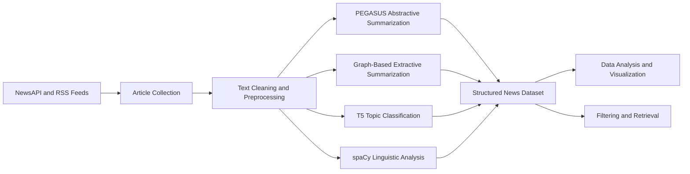

# NLP-Based News Understanding: Summarization, Classification, and Text Analysis

This project was developed as a course project for Data Science. Its main goal is to apply natural language processing methods to a collection of English news articles and convert unstructured text into information that can be summarized, classified, searched, and analyzed.

The project follows a simple pipeline: articles are collected from online news sources, cleaned, processed with pretrained NLP models, and stored in a structured dataset. The main tasks are abstractive and extractive summarization, topic classification, named entity recognition, part-of-speech tagging, and dependency parsing.

Using pretrained models keeps the project practical. Instead of training a large language model from the beginning, the focus is on understanding the NLP pipeline, comparing different text-processing methods, and analyzing their outputs with common data science tools.

## Project Pipeline



## NLP Methods

### Text Collection and Preprocessing

News articles are collected from NewsAPI and RSS feeds. Since online articles may include HTML tags, incomplete text, repeated spaces, or unrelated page content, the text is cleaned before it is passed to the NLP models.

The preprocessing stage includes:

* extracting the main article text
* removing unnecessary characters and repeated spaces
* splitting articles into sentences
* tokenizing sentences into words
* preparing titles and article bodies for the models

NLTK and spaCy are used for these operations. Preprocessing is an important part of the pipeline because noisy input can directly affect summarization, classification, and linguistic analysis.

### Abstractive Summarization with PEGASUS

The project uses `google/pegasus-xsum` to generate short summaries of news articles.

PEGASUS is an encoder-decoder Transformer designed for abstractive summarization. Unlike extractive methods, it does not only copy sentences from the article. The encoder first builds contextual representations of the input, and the decoder generates a new summary one token at a time.

A main idea behind PEGASUS pretraining is **gap-sentence generation**. Important sentences are removed from a document, and the model learns to reconstruct them using the remaining text. This makes the pretraining task close to document summarization.

The PEGASUS model family was pretrained on large text collections such as C4 and HugeNews. Some checkpoints also use different gap-sentence ratios and stochastic selection of important sentences to make pretraining less dependent on one fixed masking pattern.

The XSum checkpoint is used here because it is designed for short, direct summaries of news articles. In this project, the pretrained model is used only for inference: the article is tokenized, passed through the model, and decoded into a readable summary.

For reference, the PEGASUS-XSum model card reports the following results on the XSum test set:

| Metric  | Reported Score |
| ------- | -------------: |
| ROUGE-1 |          46.86 |
| ROUGE-2 |          24.45 |
| ROUGE-L |          39.05 |

These are reported benchmark results for the pretrained model, not results produced by this project.

The implementation is located in `summarizer.py`.

### Extractive Summarization

The project also includes a graph-based extractive summarization method.

Each sentence is represented as a node in a graph. Similar sentences are connected, and central sentences receive larger importance scores. The final summary is formed by selecting the highest-ranked sentences from the original article.

This gives a useful comparison between two types of summarization:

* **Abstractive summarization:** generates new text
* **Extractive summarization:** selects sentences from the source article

The graph-based method is implemented with NetworkX in `graph_summarizer.py`.

### Topic Classification

A T5 model fine-tuned for news-title classification assigns each article to one of eight categories:

* Business
* Entertainment
* Health
* Science
* Technology
* Politics
* Sports
* World

T5 treats NLP tasks as text-to-text problems. The input is a title or news article, and the generated output is the category label.

This stage converts unstructured text into structured labels. The labels can then be used to group articles, compare sources, and study the distribution of news topics.

The implementation is located in `topic_classifier.py`.

### Named Entity Recognition

The spaCy `en_core_web_sm` model is used to detect named entities such as:

* people
* organizations
* countries and cities
* dates
* events
* monetary values

Named entities help describe the main subjects of an article. After extraction, they can also be counted and compared across topics, sources, or time periods.

### Part-of-Speech Tagging

Part-of-speech tagging assigns a grammatical label to each token, such as noun, verb, adjective, or adverb.

These labels provide a basic description of the linguistic structure of the articles. They can also support keyword extraction, noun-phrase analysis, and simple rule-based filtering.

### Dependency Parsing

Dependency parsing finds grammatical relationships between words in a sentence.

For example, it can identify the subject of a verb or determine which word modifies another word. This gives more structural information than tokenization alone and helps analyze how information is expressed in news sentences.

## Data Science Part

The outputs of the NLP pipeline are stored as structured data using Pandas and NumPy. Each article can include fields such as:

* title and source
* publication date
* predicted topic
* abstractive and extractive summaries
* extracted named entities
* article and summary lengths
* basic linguistic features

This makes it possible to analyze the complete news collection as a dataset rather than processing each article separately.

The data science part includes:

* comparing the number of articles in each category
* analyzing article and summary lengths
* studying common words and named entities
* comparing different news sources
* examining changes in topics over time
* creating word clouds, heatmaps, and statistical plots
* reviewing incorrect or uncertain classification results

The purpose is both to find patterns in the news data and to understand how the NLP methods behave on different articles.

## Information Retrieval Part

The information retrieval stage supports the main NLP workflow.

Articles are retrieved from NewsAPI and RSS feeds and can be filtered by:

* keyword
* topic
* source
* publication date

The selected documents are then passed to the summarization, classification, and linguistic-analysis components.

This project is not intended to be a complete search engine. Retrieval is mainly used to collect and organize relevant documents before applying NLP and data analysis.

## Main Tools

| Tool             | Use in the Project                       |
| ---------------- | ---------------------------------------- |
| PEGASUS-XSum     | Abstractive summarization                |
| T5               | News topic classification                |
| spaCy            | NER, POS tagging, and dependency parsing |
| NLTK             | Text preprocessing and tokenization      |
| NetworkX         | Graph-based extractive summarization     |
| Pandas and NumPy | Data preparation and analysis            |
| Plotly           | Data visualization                       |

## Installation

Python 3.8 or newer is recommended.

```bash
pip install -r requirements.txt
python -m spacy download en_core_web_sm
```

Create a `.env` file in the main directory and add your NewsAPI key:

```env
NEWS_API=your_news_api_key
```

The Transformer models are downloaded automatically the first time they are used. PEGASUS is the largest model in the project, so several gigabytes of free storage and at least 4 GB of RAM are recommended.

## Running the Project

Run the complete pipeline with:

```bash
python main.py
```

An alternative runner is also available:

```bash
python run.py
```

## What I Learned

This project helped me understand how several NLP tasks can be connected in one practical pipeline. I worked with text preprocessing, Transformer-based summarization, graph-based summarization, topic classification, named entity recognition, and linguistic analysis.

It also showed me how NLP outputs can be converted into structured data. Once articles are represented through summaries, labels, entities, and numerical features, standard data science methods can be used to find patterns and evaluate the behavior of the system.
::: 
