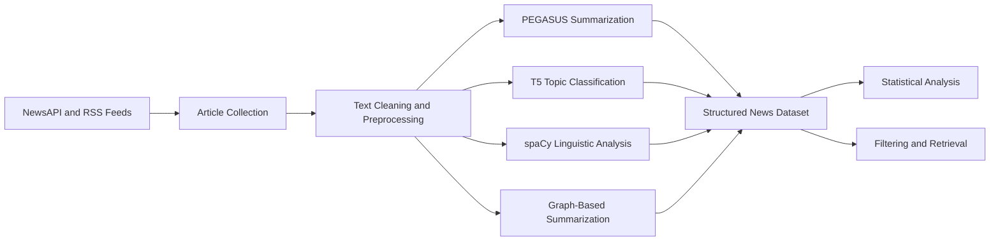

# NLP-Based News Understanding: Summarization, Classification, and Text Analysis

This project was developed as a course project for Data Science. The main goal was to apply natural language processing methods to a collection of English news articles and turn unstructured text into useful and structured information.

The project follows a simple pipeline: news articles are collected from online sources, cleaned, analyzed with NLP models, and then organized for further data analysis. The main NLP tasks are abstractive and extractive summarization, topic classification, named entity recognition, part-of-speech tagging, and dependency parsing.

Pretrained models are used throughout the project. This keeps the implementation practical and makes it possible to study how NLP models behave on real news data without training a large language model from the beginning.

## Project Pipeline



## NLP Methods

### Text Collection and Preprocessing

News articles are collected from NewsAPI and RSS feeds. Since online articles may contain HTML tags, missing sections, repeated spaces, or unrelated page content, the text needs to be cleaned before it is passed to the NLP models.

The preprocessing stage includes:

* extracting the main article text
* removing unnecessary characters and repeated spaces
* splitting the text into sentences
* tokenizing sentences into words
* preparing titles and article bodies for the models

NLTK and spaCy are used for these basic operations. This step is important because noisy input can reduce the quality of both classification and summarization.

### Abstractive Summarization

The project uses `google/pegasus-xsum` for abstractive summarization.

Abstractive summarization does not simply select sentences from the article. Instead, the model reads the input text and generates a new and shorter version of it. PEGASUS is an encoder-decoder Transformer model designed for this task.

The encoder converts the article into contextual representations. The decoder then generates the summary one token at a time. The XSum checkpoint is used because it is trained to produce short and direct summaries of news articles.

In this project, the pretrained model is used for inference only. The article text is tokenized, passed to PEGASUS, and decoded into a readable summary. The implementation is located in `summarizer.py`.

### Extractive Summarization

The project also includes a graph-based summarization method.

In this approach, each sentence is treated as a node in a graph. Similar sentences are connected, and more central sentences receive higher importance scores. The final summary is created by selecting the most important sentences from the original article.

This method is extractive because it keeps the original sentences. It provides a useful comparison with PEGASUS, which generates new text.

The graph-based method is implemented with NetworkX in `graph_summarizer.py`.

### Topic Classification

A T5 model fine-tuned for news-title classification is used to assign each article to one of eight categories:

* Business
* Entertainment
* Health
* Science
* Technology
* Politics
* Sports
* World

T5 treats NLP tasks as text-to-text problems. The input is the article title or news text, and the model generates the corresponding category label.

This task turns unstructured text into structured labels. These labels are later useful for grouping articles, comparing categories, and studying topic distributions.

The classification stage is implemented in `topic_classifier.py`.

### Named Entity Recognition

The spaCy `en_core_web_sm` model is used to detect named entities in the articles.

Named Entity Recognition identifies important expressions such as:

* people
* organizations
* countries and cities
* dates
* events
* monetary values

The extracted entities can be used to study which people, places, and organizations appear most frequently in the collected news.

### Part-of-Speech Tagging

Part-of-speech tagging assigns a grammatical label to each token, such as noun, verb, adjective, or adverb.

This information helps describe the linguistic structure of the articles. It can also support later tasks such as keyword extraction, noun-phrase analysis, and rule-based filtering.

### Dependency Parsing

Dependency parsing identifies grammatical relationships between words in a sentence.

For example, it can show which noun is the subject of a verb or which word modifies another word. This provides more detail than simple tokenization and can be useful for analyzing sentence structure.

## Data Science Part

The results of the NLP pipeline are stored as structured data using Pandas and NumPy. Each article can include fields such as:

* title
* source
* publication date
* topic
* generated summary
* extracted entities
* article length
* linguistic features

This makes it possible to analyze the news collection as a dataset rather than only processing one article at a time.

The data science part of the project includes:

* counting articles in each topic
* comparing different news sources
* analyzing article and summary lengths
* studying common words and named entities
* examining changes in topics over time
* creating word clouds, heatmaps, and statistical plots
* checking incorrect or uncertain classification results

The purpose of this stage is to understand the patterns in the data and also evaluate how the NLP methods behave on different types of articles.

## Information Retrieval Part

The information retrieval part is simple and supports the main NLP workflow.

Articles are retrieved from NewsAPI and RSS feeds and can be filtered by:

* keyword
* topic
* source
* publication date

The retrieved articles are then passed to the NLP pipeline for summarization and analysis.

This project is not designed as a complete search engine. The retrieval stage is mainly used to collect and organize relevant news documents before applying NLP and data science methods.

## Main Tools

| Tool             | Use in the Project                       |
| ---------------- | ---------------------------------------- |
| PEGASUS-XSum     | Abstractive summarization                |
| T5               | News topic classification                |
| spaCy            | NER, POS tagging, and dependency parsing |
| NLTK             | Text preprocessing and tokenization      |
| NetworkX         | Graph-based extractive summarization     |
| Pandas and NumPy | Data preparation and analysis            |
| Plotly           | Data visualization                       |

## Installation

Python 3.8 or newer is recommended.

```bash
pip install -r requirements.txt
python -m spacy download en_core_web_sm
```

Create a `.env` file in the main directory and add your NewsAPI key:

```env
NEWS_API=your_news_api_key
```

The Transformer models are downloaded automatically the first time they are used. PEGASUS is the largest model in the project, so several gigabytes of free storage and at least 4 GB of RAM are recommended.

## Running the Project

Run the complete pipeline with:

```bash
python main.py
```

An alternative runner is also available:

```bash
python run.py
```

## Project Structure

```text
NewsNLP/
├── src/
│   ├── core/
│   │   ├── content_extractor.py
│   │   ├── graph_summarizer.py
│   │   ├── news_crawler.py
│   │   ├── summarizer.py
│   │   └── topic_classifier.py
│   ├── pipeline.py
│   └── utils/
├── dataset/
├── output/
├── main.py
├── run.py
└── requirements.txt
```

## What I Learned

This project helped me understand how several NLP tasks can be connected in one practical pipeline. I worked with text preprocessing, Transformer-based summarization, topic classification, named entity recognition, linguistic analysis, and extractive summarization.

It also showed me how NLP outputs can be treated as data. After converting articles into summaries, labels, entities, and numerical features, they can be analyzed with standard data science methods to find patterns and evaluate the system.
::: 
